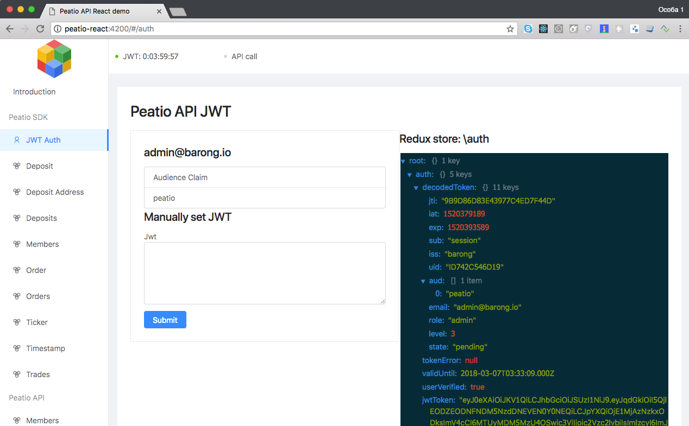

# Development guide

This article covers general approach on accessing RKCP API. 

## Authentication process

As it is mentioned in README. There are 2 ways of Authorization process:

* Out of the box Peatio frontend redirect 
* OAuth2 middleware

We will describe OAuth middleware process in this section.

Example code of Express.js is in `/server-express` folder.

To make it working you need to register new Application in Barong. Please, refer to README for details.

This example will serve React app as static files from `/develop/dist`, but also will provide OAuth2 endpoints.

To start authentication process you need to navigate to `http://peatio-react:4200/connect/barong`. 
That is exactly what happends when you click "Login with Barong" on index page `http://peatio-react:4200/`

If you have configured Barong successfully you should see something like this:



For demo purposes we put simple illustration code to `/develop/src/routes/PeatioCallback.js`

All magic is here:

```js

  componentWillMount(){
    const parsedLs = queryString.parse(this.props.location.search);
    const jwt = parsedLs.token;
    if (jwt) {
      this.props.dispatch({type: "auth/verifyToken", payload: jwt})
    }
  }
```

Connecting React and Redux store as always as simple as:

```js
export default connect(mapStateToProps)(PeatioCallback);
```

So we just extract a token from query string. Rememeber, that in this example we use HashRouter.
After getting JWT token we just dispatching `redux` action which triggers `redux-saga` effect.
Please, see `/develop/src/models/auth.js` for more details.

We are using redux-saga channel in this example.

```javascript
import { channel } from 'redux-saga'

const JWTVerifyChannel = channel()
``` 

Future examples will cover other techniques like `redux-saga` cps(Continuation Passing Style) and call.  


## Calling Peatio API

There are several ways to work with Peatio API: 

* using Peatio SDK
* using `fetch` on Peatio API
* using `axios` on Peatio API


Documentation: WIP.

## Calling Barong OTP sign API

WIP.
